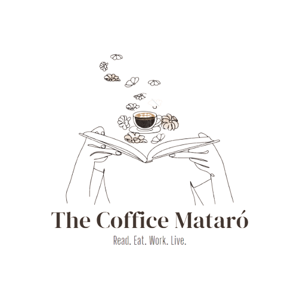

<h1 align="center"> 
    
</h1>

## Sobre The Coffice Mataró :coffee:

The Coffice Mataró es un multiespacio de uso de trabajo combinado con ocio cultural. Ofrecemos un espacio cafetería/librería y
co-working. Queremos fomentar la lectura, el trabajo en equipo y hacer que las personas que nos visiten puedan sentirse como en
casa, dotándoles de un lugar multiservicio personalizado en un ambiente tranquilo y familiar, destinado tanto a jóvenes, estudiantes,
personas emprendedoras e incluso aquellos profesionales que sólo necesitan un sitio para encontrarse de vez en cuando o para
temporadas.

## Idea :bulb:

Nuestra idea tiene como principal objetivo ofrecer un espacio con un ambiente innovador donde cualquier persona pueda encontrar
la comodidad necesaria para poder trabajar o relajarse. Surgió porque en nuestra ciudad faltan espacios así por
nosotros, los estudiantes, por ejemplo y nos propusimos hacerlo.
Por un lado, destacamos que nuestra idea tiene un plan de viabilidad que lo soporta, ya que tenemos en cuenta aquellas
personas que encuentran dificultades a la hora de encontrar un lugar tranquilo. Y los ingresos y gastos están justificados.
También tenemos en cuenta aquellas personas que necesitan un espacio donde trabajar por horas, en días concretos, en
momentos concretos de su actividad. Nosotros resolvemos estas necesidades de trabajo que responden a la seguridad,
afiliación, según Maslow; así como también atendemos al sesgo social, promoviendo por ejemplo el café - lectura. Por otra
banda, habiendo detectado algunas necesidades que consideramos fundamentales en la sociedad actual (este espacio pensado
de esta forma no existe en nuestra ciudad) hemos sido capaces de ofrecer una respuesta que tiene impacto social, ya que
en The Coffice Mataró cualquier persona puede reunirse de forma física y cercana (no a través de la red), favoreciendo así
el trabajo en equipo, sociabilizando con otras personas y también ofreciendo ocio cultural para fomentar la lectura.

## Premios CREATIC y Premios ARGÓ :trophy:

Este proyecto de CFGS ha sido ganador de 2 premios en el ámbito de mejor Proyecto Emprendedor de FP.

## Autoras :coffee:

- `Cristina Mateos Paez`: Desarrolladora web y Marketing SEO.
- `Nouhaila Benktib`: Marketing y Diseño.
- `Yousra`: Administración y Marketing.
- `Jabou Kandeh`: Marketing y publicidad.

